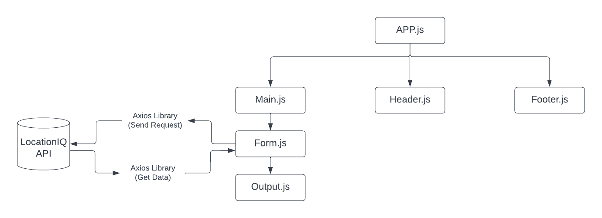
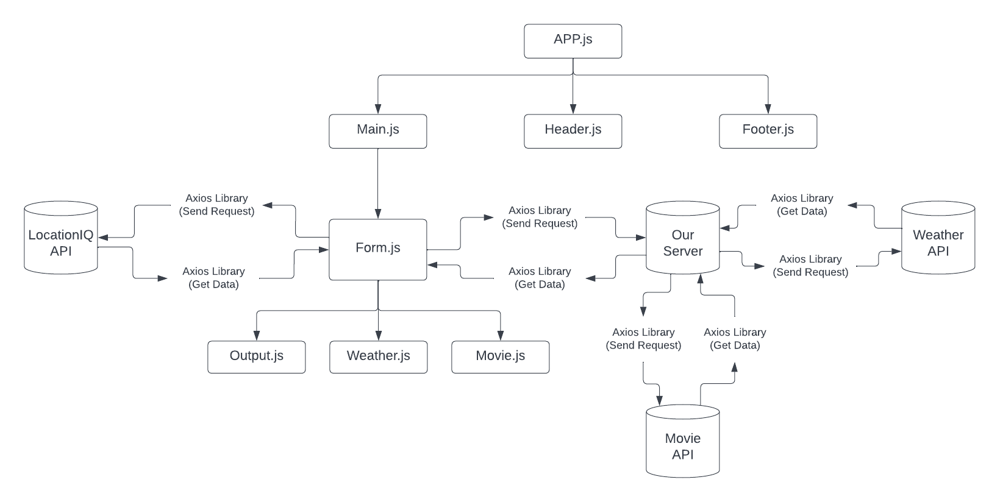

# city explore

**Author**: Ihab Abbas
**Version**: 1.0.0 (increment the patch/fix version number if you make more commits past your first submission)

## Overview
build a website the take a city name as input then git from API the other information like location image, name Latitude and longtude

## Getting Started
1. brain strom
2. create the react and emtey repo
3. link between them
4. rpm axios and bootstrap
5. craete the js files and link between them
6. git know the state and prop virabiles
7. contine coding the function and the forms
8. style the website

## Architecture
1. bootstarp
2. CSS file

## Change Log
<!-- Use this area to document the iterative changes made to your application as each feature is successfully implemented. Use time stamps. Here's an example:

01-01-2001 4:59pm - Application now has a fully-functional express server, with a GET route for the location resource. -->

## Credit and Collaborations
1. brain storm with Yazan Alfarra
2. check the demo code 

# Name of feature: ihab abbas

# Estimate of time needed to complete: an hour and a half

# Start time: 7:00 pm

# Finish time: 8:30 pm

# Actual time needed to complete: an hour

# Name of feature: ihab abbas

# Estimate of time needed to complete: 5 hours

# Start time: (19:00 29-8-22) (14:30 30-8-22)

# Finish time:  (21:00 29-8-22) (17:30 30-22)

# Actual time needed to complete: 2 hours

# Estimate of time needed to complete: 5 hours

# Start time: (19:00 29-8-22) (14:30 30-8-22)

# Finish time:  (21:00 29-8-22) (17:30 30-22)

# Actual time needed to complete: 2 hours

